# 无人机信号搜救系统

[English Version](README.md)

这是一个基于 **ROS1 / PX4** 的**自主无人机信号搜救系统**展示版仓库。系统围绕“低空求救信号搜索定位”任务，融合了 **LoRa 无线信号感知**、**Livox Mid-360 激光雷达建图定位**、**RealSense D435 视觉确认**、**DK2500 地面站搜索融合决策**、**任务监管** 和 **修改版 EGO-Planner 局部轨迹规划**。

<p align="center">
  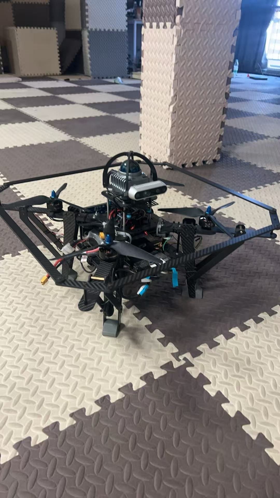
</p>

<p align="center">
  <b>“智寻”项目使用的自主无人机平台。</b>
</p>

---

## 项目亮点

- **信号引导搜索**：将 LoRa 的 RSSI / SNR 证据与空间信息融合，推断求救信号源可能区域。
- **多源感知**：使用 Livox Mid-360 + FAST-LIO 完成建图定位，使用 D435 进行可见光视觉确认。
- **地面站智能决策**：DK2500 负责高层搜索融合、路线生成与人机交互。
- **自主飞行执行**：Jetson 端任务监管程序将 DK2500 的路线命令桥接到修改版 EGO-Planner 与 PX4/MAVROS。
- **实飞验证**：仓库中直接附带 **室内 Demo** 与 **室外 Demo**，便于评审老师快速查看。

---

## 实飞演示 Demo

<table>
<tr>
<td width="50%" align="center" valign="top">

<a href="assets/demo/demo_indoor_end_to_end.mp4">
  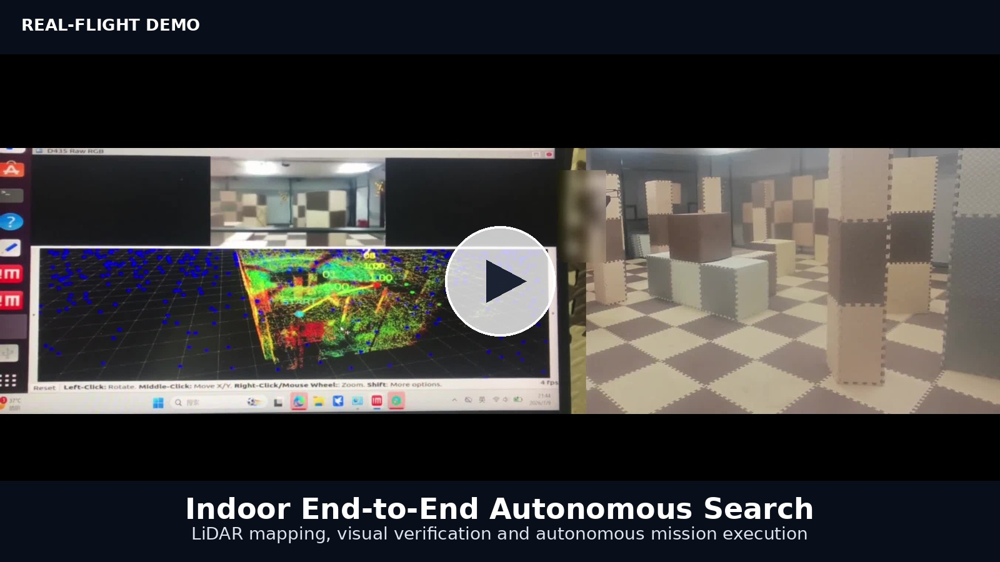
</a>

**室内端到端自主搜索 Demo**  
展示建图、视觉确认与任务执行全过程。

[▶ 点击查看室内 Demo](assets/demo/demo_indoor_end_to_end.mp4)

</td>
<td width="50%" align="center" valign="top">

<a href="assets/demo/demo_outdoor_field_test.mp4">
  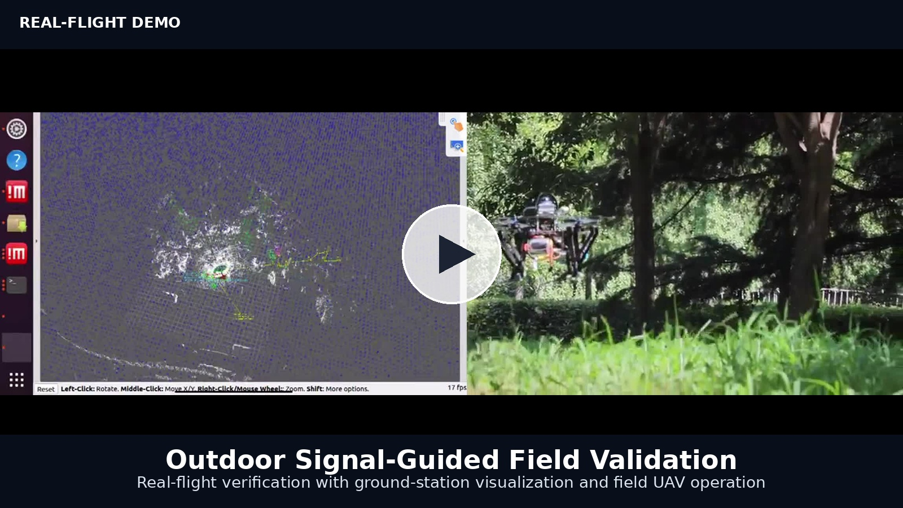
</a>

**室外信号引导实飞验证 Demo**  
展示地面站可视化、信号引导与实飞任务验证。

[▶ 点击查看室外 Demo](assets/demo/demo_outdoor_field_test.mp4)

</td>
</tr>
</table>

> 若 GitHub 页面未直接内嵌播放 MP4，可点击链接单独打开视频文件。

---

## 系统架构图

<p align="center">
  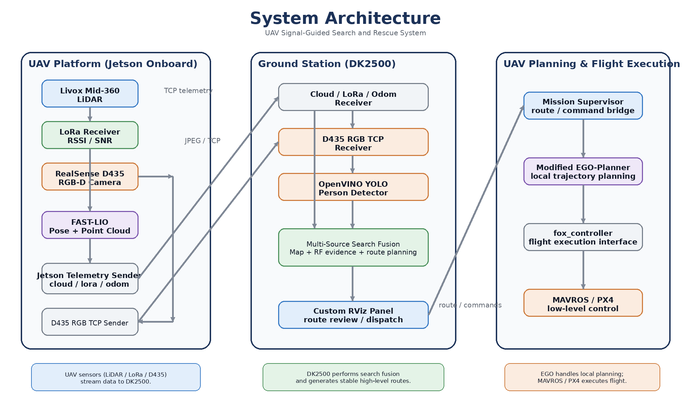
</p>

### 核心运行逻辑

1. **无人机端感知与定位**  
   无人机搭载 Livox Mid-360 和 D435，相应位姿与点云由 FAST-LIO 输出。
2. **数据转发**  
   Jetson 将 **点云 + LoRa + 里程计** 数据发送到 DK2500，同时单独通过 TCP 传输 D435 RGB 图像。
3. **地面站搜索融合**  
   DK2500 融合地形 / 可通行空间 / RF 证据，生成稳定的高层搜索路线。
4. **任务桥接**  
   `uav_mission_supervisor.py` 接收 DK2500 下发的路线 / 命令，并转化为规划器目标。
5. **局部规划与飞行执行**  
   修改版 EGO-Planner 负责局部避障与轨迹生成，`fox_controller` + MAVROS + PX4 执行飞行任务。

---

## 运行效果截图

<p align="center">
  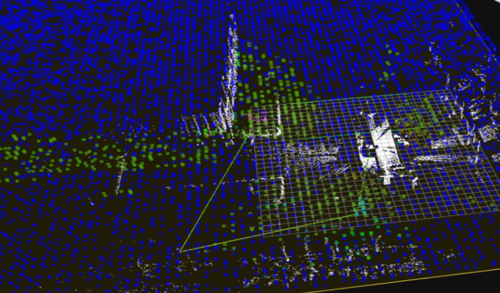
</p>

<p align="center">
  <b>地面站 RViz 运行界面：点云地图、路径推理与搜索规划结果。</b>
</p>

---

## 硬件组成

### 无人机端组成部分

<table>
<tr>
<td width="33%" align="center">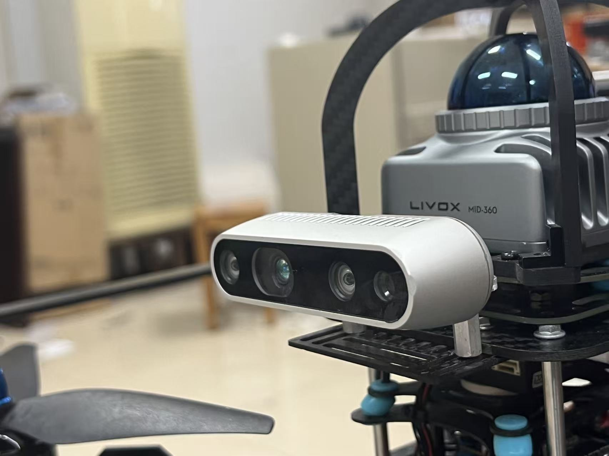<br><b>传感器总览</b><br>Livox Mid-360 + RealSense D435</td>
<td width="33%" align="center">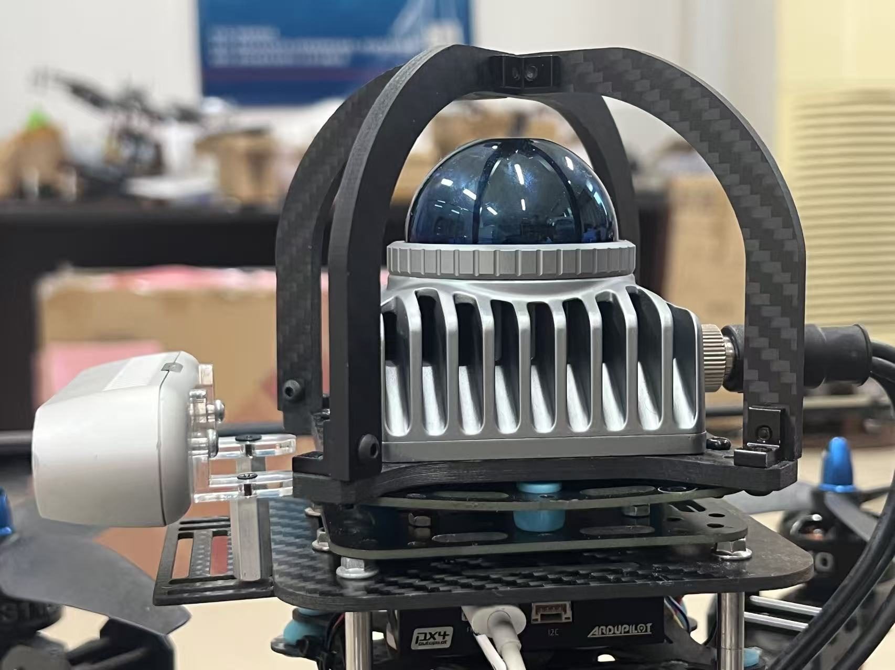<br><b>Livox Mid-360</b><br>雷达模块与安装结构</td>
<td width="33%" align="center">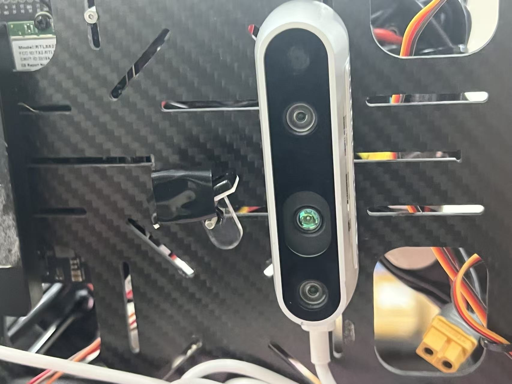<br><b>RealSense D435</b><br>前向 RGB-D 相机安装</td>
</tr>
<tr>
<td width="33%" align="center">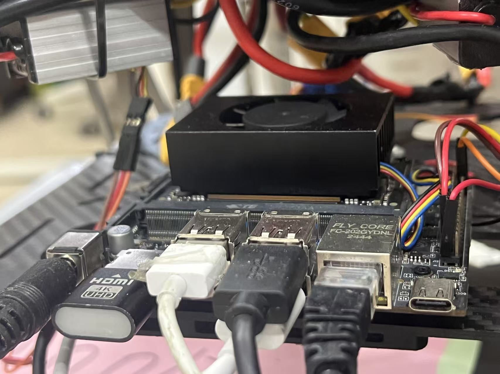<br><b>机载计算单元</b><br>Jetson 计算平台</td>
<td width="33%" align="center">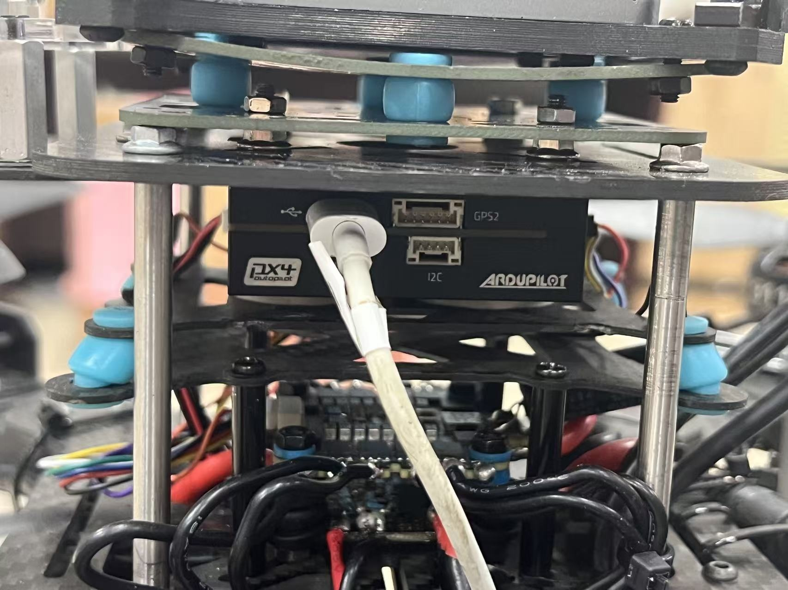<br><b>飞控硬件</b><br>PX4 / ArduPilot 硬件栈</td>
<td width="33%" align="center">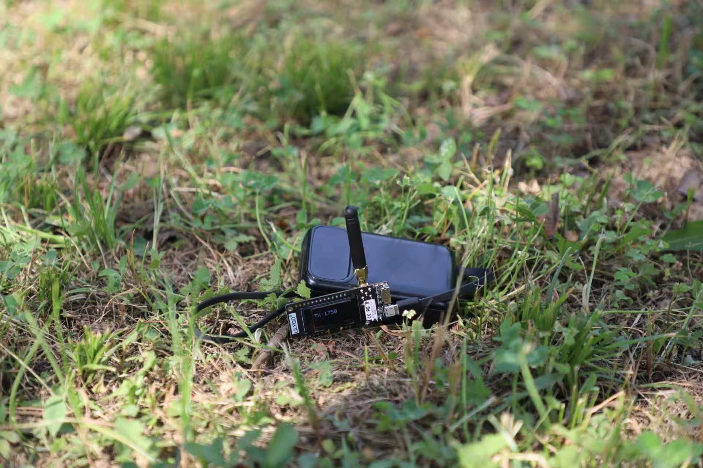<br><b>LoRa 求救信号终端</b><br>无线信号源 / 求救信标</td>
</tr>
</table>

### 地面站组成部分

<table>
<tr>
<td width="50%" align="center">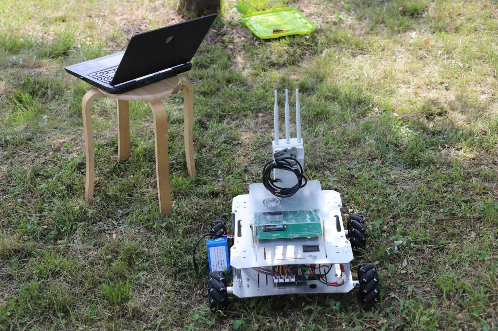<br><b>地面站场景</b><br>室外部署形态</td>
<td width="50%" align="center">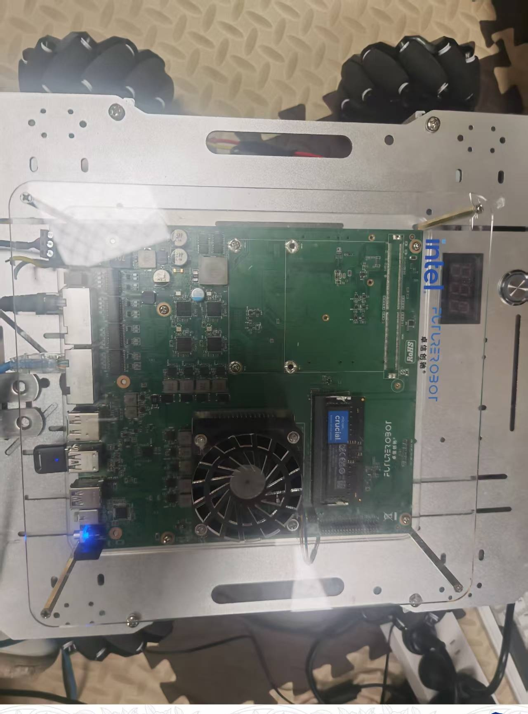<br><b>地面计算平台</b><br>DK2500 硬件平台</td>
</tr>
</table>

---

## 仓库结构

```text
uav-signal-search-and-rescue/
├── assets/
│   ├── demo/
│   ├── diagrams/
│   └── images/
├── config/
├── docs/
├── ground_station/
│   ├── nodes/
│   │   ├── dk2500_cloud_lora_odom_receiver.py
│   │   ├── d435_rgb_tcp_receiver.py
│   │   └── openvino_yolo_person_detector.py
│   └── ros_ws/src/
├── third_party/
│   └── fast-drone-250-modifications/
├── uav/
│   ├── nodes/
│   │   ├── d435_rgb_tcp_sender.py
│   │   ├── jetson_cloud_lora_odom_sender.py
│   │   └── uav_mission_supervisor.py
│   └── ros_ws/src/
├── archive/
├── NOTICE.md
├── README.md
└── README_zh-CN.md
```

---

## 关键源码位置

### 无人机端
- `uav/nodes/jetson_cloud_lora_odom_sender.py` —— 将 cloud / LoRa / odom 遥测发送到 DK2500
- `uav/nodes/d435_rgb_tcp_sender.py` —— 向 DK2500 传输 D435 RGB 图像流
- `uav/nodes/uav_mission_supervisor.py` —— 接收路线 / 命令并发布规划目标

### 地面站端
- `ground_station/nodes/dk2500_cloud_lora_odom_receiver.py` —— 接收并重新发布遥测数据
- `ground_station/nodes/d435_rgb_tcp_receiver.py` —— 接收 D435 RGB 图像流
- `ground_station/nodes/openvino_yolo_person_detector.py` —— 行人检测与高亮框显示
- `ground_station/ros_ws/src/` —— 搜索融合与 RViz 面板相关源码

### 规划与执行
- `third_party/fast-drone-250-modifications/overlay/` —— 项目修改过的 EGO / Fast-Drone-250 相关覆盖文件
- `docs/EGO_PLANNER_MODIFICATIONS.md` —— 修改说明

---

## 说明文档

- [`docs/RUN_GUIDE.md`](docs/RUN_GUIDE.md) —— 运行流程与启动说明
- [`docs/ROS_INTERFACES.md`](docs/ROS_INTERFACES.md) —— ROS 话题与接口说明
- [`docs/COMMUNICATION_PROTOCOL.md`](docs/COMMUNICATION_PROTOCOL.md) —— 通信与数据传输说明
- [`docs/CORE_FILE_LIST.md`](docs/CORE_FILE_LIST.md) —— 核心文件清单
- [`docs/PROJECT_CONTRIBUTIONS.md`](docs/PROJECT_CONTRIBUTIONS.md) —— 项目贡献概述

---

## 重要说明

- **IP、端口、串口、RC 映射、模型路径等参数均与现场部署相关**，需要根据实际环境配置，不应直接视为固定常量。
- 该仓库是一个**面向公开展示的整理版**，保留核心架构与代表性源码，不包含大型日志、ROS bag、模型大文件等冗余内容。
- 仓库中保留了**项目实际修改过的规划器相关覆盖文件**，但**不主张完整上游 EGO-Planner / Fast-Drone-250 均为原创代码**。

---

## 致谢

本仓库用于系统化展示 **“智寻”无人机信号搜救项目** 的核心代码、系统结构与实飞验证结果，便于竞赛展示、技术审阅与项目汇报。
